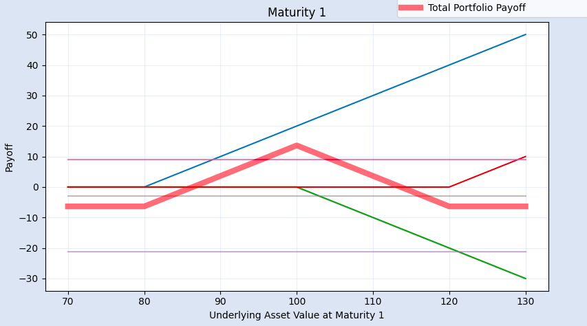

# Payoff Profiles and Spreads

<figure align='middle'>
    
    <figcaption>Figure 1: Butterfly Spread Example</figcaption>
</figure>

In this repository I define the `Derivative` and `Portfolio` classes. The goal of these classes is to help visualise portfolio payoff profiles at different maturities, easily customise a portfolio and finally to visualise spreads. Black-Scholes option pricing formulae are included so that option prices can be taken into account when viewing the portfolio's payoff.

